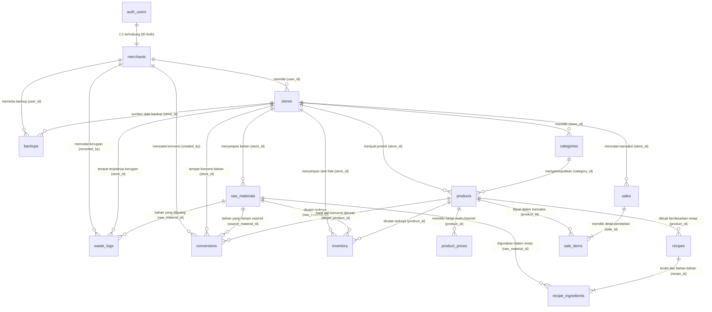

# Relasi Skema Database (Entity Relationship)

Dokumen ini menjelaskan relasi antar entitas (tabel) berdasarkan skema database Frozen Food POS (seperti yang dijabarkan dalam `DATABASE.MD`). 

Memahami relasi ini sangat penting untuk membangun model ORM (seperti Sequelize) atau menulis Query SQL yang optimal menggunakan `JOIN`.

## Diagram Entity Relationship (ERD)

Berikut adalah visualisasi ERD dari skema database Anda:

---

## Penjelasan Relasi per Tabel

### 1. `merchants`
*   **One-to-One (1:1)** dengan `auth.users` dari Supabase. Satu UUID merchant terikat dengan satu user authentication.
*   **One-to-Many (1:N)** dengan `stores`. Satu *merchant* (pemilik) bisa memiliki banyak cabang/toko.
*   **One-to-Many (1:N)** dengan `waste_logs`, `conversions`, dan `backups`. Satu *merchant* bisa melakukan/mencatat banyak hal ini dalam sistem.

### 2. `stores`
Tabel ini merupakan **pusat** operasional untuk cabang spesifik.
*   **Many-to-One (N:1)** dengan `merchants`. (Banyak cabang dimiliki oleh satu merchant).
*   **One-to-Many (1:N)** ke hampir semua tabel master & operasional:
    *   `categories`
    *   `raw_materials`
    *   `products`
    *   `sales`
    *   `inventory`
    *   `waste_logs`
    *   `conversions`
    *   `backups`
    Setiap data di tabel-tabel tersebut dikaitkan ke spesifik satu toko (cabang) tempat data itu relevan, sehingga laporan tiap cabang bisa dipisah.

### 3. `categories`
*   **Many-to-One (N:1)** dengan `stores`. (Kategori ini dibuat untuk toko mana).
*   **One-to-Many (1:N)** dengan `products`. Satu kategori (contoh: "Nugget") bisa memiliki banyak varian produk jadi.

### 4. `raw_materials`
*   **Many-to-One (N:1)** dengan `stores`.
*   **One-to-Many (1:N)** dengan `recipe_ingredients`. Satu jenis bahan mentah bisa dipakai di banyak resep yang berbeda.
*   **One-to-Many (1:N)** dengan `inventory`. Catatan stok gudang bahan tersebut.
*   **One-to-Many (1:N)** dengan `waste_logs` dan `conversions`. (Mencatat jika bahan tersebut rusak/dibuang, atau jika bahan tersebut dikonversi).

### 5. `products`
*   **Many-to-One (N:1)** dengan `stores` dan `categories`.
*   **One-to-Many (1:N)** dengan `product_prices`. Satu produk jadi bisa punya banyak aturan harga (Offline, GrabMart, ShopeeFood).
*   **One-to-Many (1:N)** dengan `recipes`. (Dalam kasus di mana satu produk mungkin punya beberapa versi resep seiring waktu, walau biasanya yang aktif cuma satu).
*   **One-to-Many (1:N)** dengan `sale_items`. Satu jenis produk bisa dibeli berkali-kali pada struk/transaksi yang berbeda.
*   **One-to-Many (1:N)** dengan `inventory` (stok gudang barang jadi).
*   **One-to-Many (1:N)** dengan `conversions` (sebagai hasil akhir / `target_product_id` dari pengolahan bahan sisa).

### 6. `product_prices`
*   **Many-to-One (N:1)** dengan `products`. (Harga khusus untuk produk X di platform tertentu).

### 7. `recipes` & 8. `recipe_ingredients`
*   **Many-to-One (N:1)** `recipes` milik `products`. Resep untuk produk tertentu.
*   **One-to-Many (1:N)** `recipes` memiliki banyak `recipe_ingredients` (bahan-bahan penyusunnya).
*   **Many-to-One (N:1)** `recipe_ingredients` mengacu ke resep utama (`recipe_id`) dan bahan mentah yang dipakai (`raw_material_id`). (Ini pada dasarnya merepresentasikan **Many-to-Many** antara Produk dan Bahan Baku).

### 9. `sales` & 10. `sale_items`
*   **Many-to-One (N:1)** `sales` (Header Invoice) terjadi di satu `stores`.
*   **One-to-Many (1:N)** `sales` memiliki banyak `sale_items` (Isi keranjang belanja / struk).
*   **Many-to-One (N:1)** `sale_items` merujuk pada `sales` (ini struk mana) dan `products` (barang apa yang dibeli).

### 11. `inventory`
*   **Many-to-One (N:1)** dengan `stores`.
*   **Many-to-One (N:1)** dengan `products` (Opsional, jika stok produk jadi).
*   **Many-to-One (N:1)** dengan `raw_materials` (Opsional, jika stok bahan mentah).
*   *(Catatan: Salah satu dari product_id atau raw_material_id akan bernilai NULL untuk satu baris inventori, bergantung pada tipe itemnya).*

### 12. `waste_logs`
*   **Many-to-One (N:1)** dengan `stores` (Lokasi rugi), `raw_materials` (Barang yang terbuang), dan `merchants` (Pencatat).

### 13. `conversions`
*   **Many-to-One (N:1)** dengan `stores`.
*   **Many-to-One (N:1)** dengan `raw_materials` sebagai bahan baku yang diselamatkan (`source_material_id`).
*   **Many-to-One (N:1)** dengan `products` sebagai barang jadi/darurat yang dihasilkan (`target_product_id`).
*   **Many-to-One (N:1)** dengan `merchants` (Pencatat).

### 14. `backups`
*   **Many-to-One (N:1)** dengan `stores` (data mana yang dibackup) dan `merchants` (siapa yang memintanya).

---

## Hal Penting Saat Mengimplementasi ORM (Sequelize/Prisma)

1.  **Foreign Keys dan Constrain:** Pastikan semua Foreign Key yang mereferensikan tabel induk (seperti `store_id`) menggunakan `ON DELETE CASCADE` atau `ON DELETE RESTRICT` secara hati-hati. 
    *   *Contoh:* Menghapus Toko (`stores`) mungkin akan sangat berbahaya jika Anda punya data transaksi (`sales`) di dalamnya. Sebaiknya Anda menggunakan konsep *soft delete* (misal: `is_active = FALSE`).
2.  **Membaca Struk (Eager Loading):** Untuk menampilkan sebuah Invoice Penjualan lengkap, Anda akan menarik data `sales` dan "Include" (mengambil relasi) `sale_items`, dan pada `sale_items` Anda meng-Include `products` untuk menampilkan namanya.
3.  **Tabel Pivot Implisit:** `recipe_ingredients` dan `sale_items` pada dasarnya berfungsi sebagai tabel pivot/junction yang memiliki informasi ekstra (seperti qty dan harga HPP snapshot).
